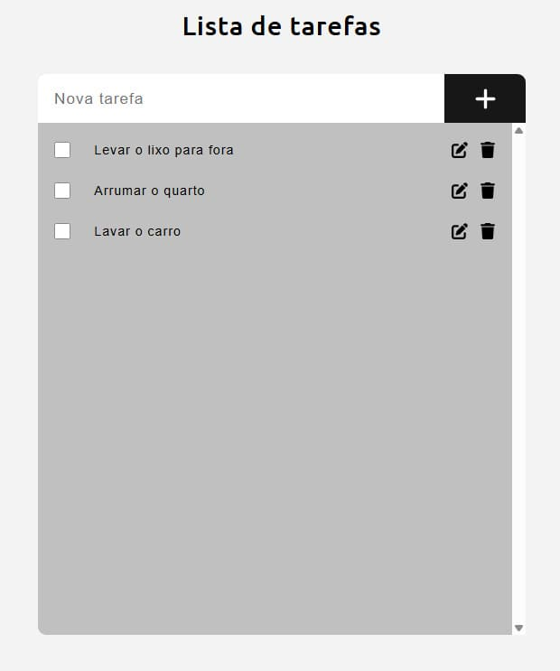

# 📝 Lista de tarefas

Este é um projeto de uma lista de tarefas simples, desenvolvido com HTML, CSS e JavaScript, como prática de manipulação do DOM, lógica condicional e interatividade na web.

## 🎮 Como funciona

- O usuário insere uma nova tarefa no campo de texto e adiciona clicando no botão "+".
- As tarefas adicionadas são listadas dinamicamente na tela.
- Cada tarefa pode ser marcada como concluída através de um checkbox.
- É possível editar o texto de uma tarefa existente.
- É possível excluir uma tarefa da lista.

## ✨ Funcionalidades

- ➕ Adicionar novas tarefas
- ✅ Marcar tarefas como concluídas (com feedback visual)
- ✏️ Editar tarefas
- 🗑️ Excluir tarefas
- 🕹️ Interface simples e responsiva

## 🧠 O que foi praticado

- Manipulação do DOM com JavaScript
- Eventos e lógica condicional
- Estrutura e semântica com HTML5
- Estilização e responsividade com CSS3

## 📸 Prévia

## 🕹️ Teste agora

Quer organizar suas tarefas de forma prática? <a href="https://task-list-omega-gules.vercel.app/">Clique aqui</a> para acessar o projeto diretamente do seu navegador.

## 📄 Licença

Este projeto está licenciado sob a MIT License — veja o arquivo <a href="https://github.com/alcamarano/task-list/blob/main/LICENSE">LICENSE</a> para mais informações.
